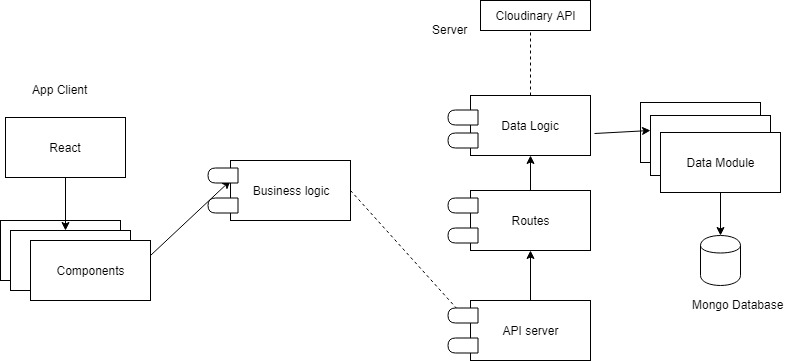

# HandyMan APP

## Intro 
----

This application it thought to help people with any sort of domestic repair to find someone that can fix this problem.

## Functional description
----
The handyman app allows users to upload possible domestic repair jobs and allow other users to apply to be able to do said job. 

After the user assigns another user to do said job, he will be rated on the result and it will be displayed on their profile.

## **Use cases**

## Technical Description
---

The application is a web application that is meant to run within a browser environment. It consists of a ReactJS frontend with Bulma and Bootstrap that connects to two APIs.

 - The first API is RESTful and handles both the user data and the jobs they publish.
 - User data is persistent across page reloads, as local data is stored in the user's SessionStorage.
 - The second API is the Cloudinary API where photos may be uploaded for each job created.

The technologies used with the API includes the Express framework for Node.js, and Mongoose as a Object Data Modeling (ODM) library for MongoDB.

## API tests
---
 

## Block model

## Data Model

